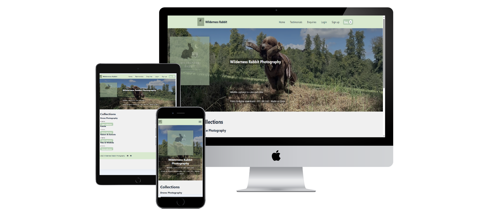
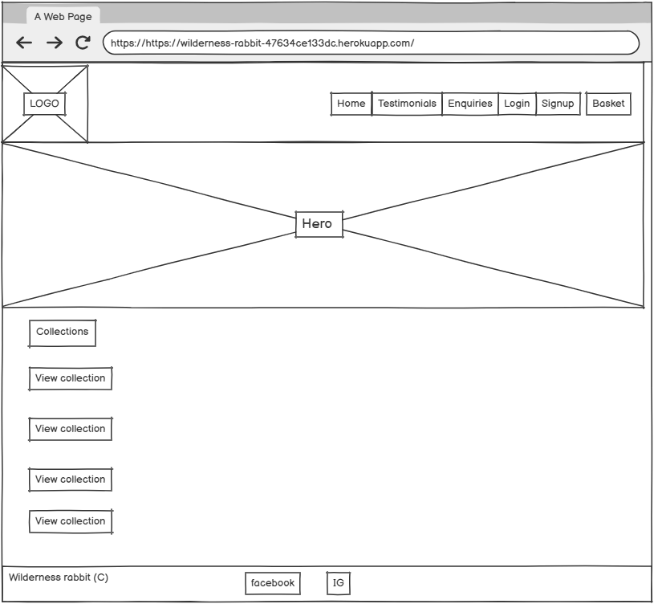
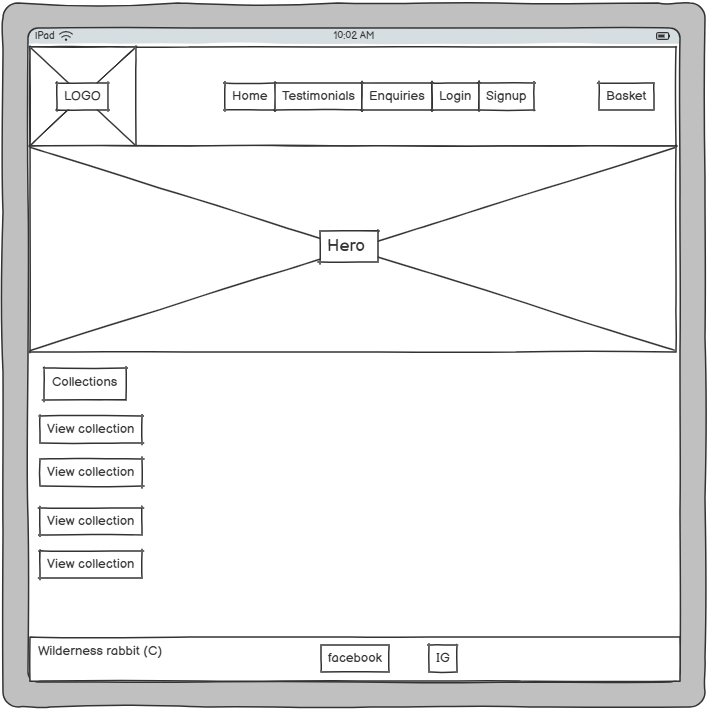
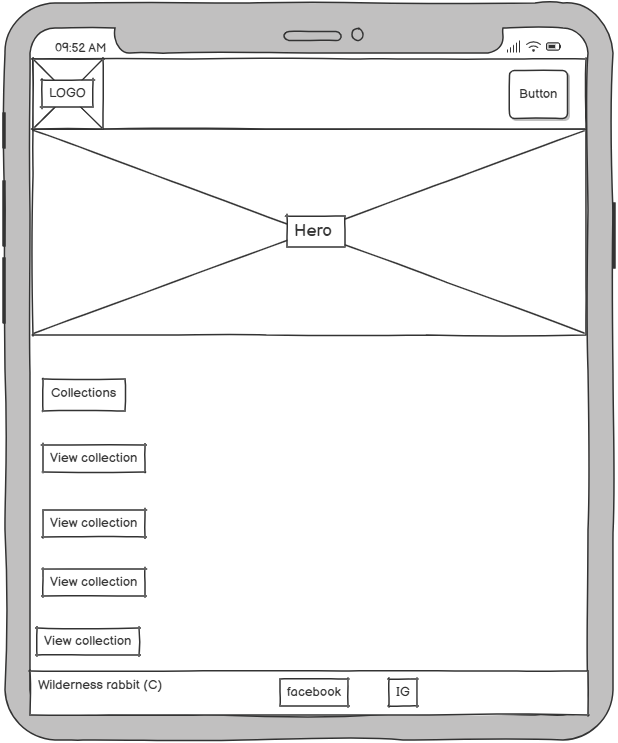
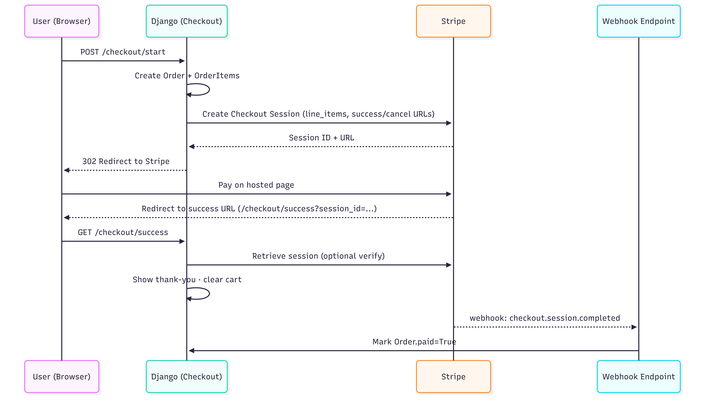
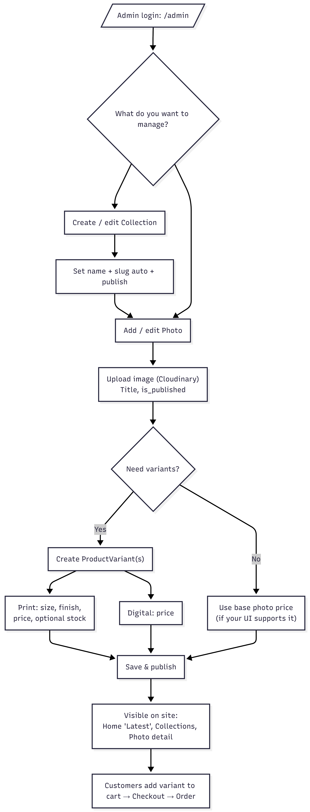
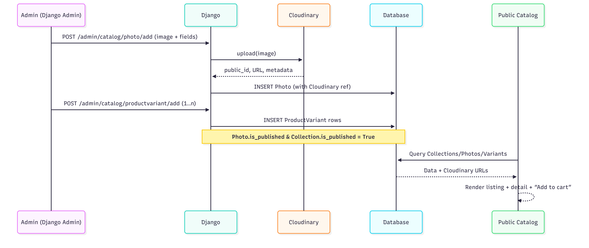

# Wilderness Rabbit Photography

A Django-powered portfolio & print store for a photographer. Browse a curated catalog, add favourites to a cart, and pay securely with Stripe. Images are served from Cloudinary for fast, responsive delivery.

 **Live site:** <https://wilderness-rabbit-47634ce133dc.herokuapp.com>  
 **Repository:** <https://github.com/rory-codes/wildness_rabbit_photography>

## Table of Contents
- [Wilderness Rabbit Photography](#wilderness-rabbit-photography)
- [Overview](#overview)
  - [Project goals](#project-goals)
- [UX](#ux)
  - [User profiles](#user-profiles)
  - [User Stories](#user-stories)
  - [Sprint Plan](#sprint-plan)
- [Features](#features)
  - [Design](#design)
    - [Brand/Typography](#brandtypography)
    - [Color palette](#color-palette)
    - [Wireframes](#wireframes)
      - [Desktop](#desktop)
      - [Tablet](#tablet)
      - [Mobile](#mobile)
- [Security, Performance & Accessibility](#security-performance--accessibility)
- [Technologies](#technologies)
- [Data Model](#data-model)
  - [Entity relationship diagram](#entity-relationship-diagram)
  - [Flow diagram](#flow-diagram)
  - [Stripe flow diagram](#stripe-flow-diagram)
  - [Admin flow diagram](#admin-flow-diagram)
  - [Photo/variant/cloudinary flow diagram](#photophoto-variantcloudinary-flow-diagram)
- [Deployment](#deployment)
  - [Version control](#version-control)
  - [Set up](#set-up)
  - [Local deployment](#local-deployment)
  - [Deployment to Heroku](#deployment-to-heroku)
- [Testing](#testing)
  - [Manual testing](#manual-testing)
  - [Automated testing](#automated-testing)
    - [Lighthouse](#lighthouse)
    - [Wave (Accessibility)](#wave-accessibility)
    - [HTML Validator](#html-validator)
    - [CSS Validator](#css-validator)
    - [Jest](#jest)
    - [Pytest](#pytest)
- [Issues/Fixes](#issuesfixes)
  - [Unfixed / Known Issues](#unfixed--known-issues)
  - [Recently Fixed](#recently-fixed)
- [Future Releases](#future-releases)
  - [Planned Enhancements](#planned-enhancements)
- [Credits & Thanks](#credits-thanks)
  - [Credits](#credits)
  - [Thanks](#thanks)

---

## Overview
**Wilderness Rabbit Photography** is a full‑stack web app built with Django 5 that showcases a photographer’s portfolio and enables simple e‑commerce for prints. It focuses on a clean, mobile‑first gallery experience, fast media delivery, and an approachable checkout.

### Project goals
* Showcase images in a performance‑friendly grid and detail pages.  
* Convert interested visitors into customers via a frictionless cart/checkout.  
* Provide the owner with simple catalog management and order tracking.
* Use a range of software languages including HTML5, CSS3, JavaScipt, Python.
* Responsive gallery grid with server‑side pagination
* Photo detail pages (Cloudinary responsive images)
* Cart add/update/remove; mini‑cart indicator
* Stripe checkout with webhooks
* Account creation & email verification (django‑allauth)
* Testimonials
*  enquiries
*  Django admin for catalog management
*  Static files via WhiteNoise; production ready Procfile

---

## UX

### User profiles

| User profile | Summary | Key Goals |
|---|---|---|
| **Visitor (Guest)** | Lands on site from search/social | Browse gallery, filter by category, view large images, enquire or buy |
| **Registered Customer** | Returns to purchase | Faster checkout, saved address, view order history, leave testimonial |
| **Photographer (Site Owner)** | Manages content & orders | Upload images, set pricing/variants, approve testimonials, see orders |

### User Stories 
#### Must haves
* **Browse the gallery (catalog list + pagination):** As a visitor, I want to browse the photo catalog so I can discover images to buy.
* **View photo detail:** As a visitor, I want a photo detail page so I can evaluate and buy.
* **Cart: add/update/remove:** As a shopper, I want to manage my cart so I can purchase multiple items.
* **Checkout with Stripe:** As a shopper, I want a secure checkout so I can pay and receive confirmation.
* **Allauth (signup/login/reset):** As a visitor, I want to create an account so I can track orders and checkout faster.
* **Profile & Order History:** As a customer, I want to update my profile and see past orders.
* **Testimonials & Enquiries:** As a visitor, I want to leave feedback or ask a question.
* **Owner: manage catalog:** As the photographer, I want to add/edit photos with prices and categories so I can run the shop.

#### Should haves
* **Search & Filters:** As a visitor, I want to search and filter the gallery so I can find what I like quickly.
* **Favourites:** As a customer, I want to favourite photos so I can revisit them later.
* **Performance and image optimisation:** As a visitor, I want fast pages so the site feels snappy on mobile.
* **Basic shipping and tax configuration:** As a shopper, I want charges to be clear so there are no surprises.
* **Owner notifications:** As the photographer, I want alerts for new orders/enquiries so I can respond quickly.

#### Could haves
* **Discount codes:** As a shopper, I want to apply a promo code so I can get a discount.
* **Guest checkout:** As a visitor, I want to check out as a guest so I don’t have to register.
* **Social media logins:** As a visitor, I want quick sign-in so I can avoid passwords.

### Sprint Plan 
#### Sprint 1 – Foundations & Auth (Must)

* **Goals:** Project scaffolding, deployment baseline, authentication.
* **Deliverables:** Working Django app on Heroku with web dyno; allauth flows; base templates; gallery & product detail read‑only; Cloudinary & WhiteNoise configured; error pages.
* **Definition of Done (DoD):** Deployed; lint passes; key happy‑path manual test plan complete. Risks/Mitigations: Env config drift → env sample & django-environ; Procfile/dynos → checklist.

#### Sprint 2 – Catalog & Cart (Must)

* **Goals:** Shoppable catalog and robust basket.
* **Deliverables:** Add/update/remove cart; totals; messages; responsive cards; category pages.
* **DoD:** Unit tests for cart math; a11y checks; pagination stable under >100 items.

#### Sprint 3 – Checkout & Orders (Must/Should)
* **Goals:** Payments, orders, profiles.
* **Deliverables:** Stripe checkout + webhooks; order creation; email receipts; profile with order history & saved address.
* **DoD:** Test cards succeed/fail; webhook idempotency; email previews.

#### Sprint 4 – Content & Enhancements (Should/Could)
* **Goals:** Marketing & UX polish.
* **Deliverables:** Search/filter/sort; testimonials with moderation; enquiry form; SEO/sitemap; optional wishlist/lightbox/coupons/blog.
* **DoD:** Lighthouse ≥ 90 perf/a11y/best‑practices; docs updated; release notes.

---

## Features
The application wilderness_rabbit_photography applied UI principles to align with Wilderness Rabbit brand and provide consistency throughout the build and deployment.
This was achieved with the following:

### Design
#### Brand/Typography
**The following typography and brand were used to create the logo and used through the application**

#### Color palette
**The following colour palette was used to create the brand and used in the root CSS to style the application:**

#### Wireframes
##### Desktop

##### Tablet

##### Mobile

### Security, Performance & Accessibility
* **Security:** env‑based secrets; CSRF protection; HTTPS on production; webhook signature verification; admin limited to staff.
* **Performance:** Cloudinary transformations; lazy‑loading; compressed static files via WhiteNoise; DB indexing on common filters.
* **Accessibility:** Semantic HTML, focus states, aria labels on pagination & buttons; colour‑contrast checked; images include alt text.

---

### Technologies
* **Backend:** Python 3.13, Django 5.2, PostgreSQL (Heroku Postgres), SQLite (dev)
* **Auth:** django‑allauth
* **Payments:** Stripe
* **Media:** Cloudinary + `django-cloudinary-storage`
* **Styling/UI:** Django templates, crispy‑forms + crispy‑bootstrap5
* **Static & WSGI:** WhiteNoise, Gunicorn
* **Config:** `dj-database-url`, `python-dotenv`
* **Hosting:** Heroku (Heroku‑24 stack)

---

## Data Model
The application uses data to help users as a primary tool to allow users to buy and download images from the application. For the data to be used efficiently it was important to map out the data and how it would be used. Therefore, the following diagrams were produced to help map out the app build and align with the development of the wilderness_rabbit_photography application:

### Entity relationship diagram

### Flow diagram

### Stripe flow diagram

### Admin flow diagram

### Photo/photo variant/cloudinary flow diagram

---

## Deployment
The application involved deployment locally and via heroku, this meant that a variety of concepts were implemented during development:

### Version control
**The site was developed in VS Code (vitual studio) and pushed through to the wilderness_rabbit_photography repository (Github).**
**Git commands used in development envionment:**
* git add <file>
* git commit -m "commit message contents e.g: Update readme"
* git push
  
### Set up
#### Create and activate virtual enviromnent (venv):
* python -m venv .venv 
#### Install dependencies:
* pip install -r requirements.txt

### Local deployment
#### Apply database migrations:
* python manage.py makemigrations
* python manage.py migrate
#### Collect static files:
* python manage.py collectstatic
#### Update environment variables:
* DEBUG=False
* ALLOWED_HOSTS
* DATABASE_URL
#### Run the development server:
* python manage.py runserver
* This will open the application locally at: http://127.0.0.1:8000/

### Deployment to Heroku
#### Ensure required files are present:
* requirements.txt 
* Procfile (web: gunicorn wilderness_rabbit.wsgi)
#### Log in to Heroku and create an app:
* heroku login
* heroku create wilderness-rabbit
#### Set environment variables:
* heroku config:set DEBUG=False
* heroku config:set ALLOWED_HOSTS=wilderness-rabbit.herokuapp.com
* heroku config:set DATABASE_URL
#### Push to Heroku:
* git push heroku main
#### Run migrations and collect static files:
* heroku run python manage.py migrate
* heroku run python manage.py collectstatic (using whitenoise- includding in middleware/settings.py)
#### Open the deployed application:
* heroku open
* This will open the application at: https://wilderness-rabbit-47634ce133dc.herokuapp.com/

---

## Testing
The application required substantial testing to ensure that it worked locally and also in the deployed site. This was an integral part of the build and involved the following processes:

### Manual testing
 **Navigation**
 | Test            | Steps                      | Expected Result                              | Actual Result |
| --------------- | -------------------------- | -------------------------------------------- | ------------- |
| Load homepage   | Visit site root URL        | Homepage loads without errors                | Pass          |
| Navbar links    | Click each navigation link | User is routed to correct page               | Pass          |
| Responsive menu | Resize screen to mobile    | Mobile menu displays and functions correctly | Pass          |
| Logo link       | Click site logo            | Redirects to homepage                        | Pass          |
| Broken links    | Click all visible links    | No broken or dead links                      | Pass          |

 **Catalog**
 | Test                  | Steps                                 | Expected Result                      | Actual Result |
| --------------------- | ------------------------------------- | ------------------------------------ | ------------- |
| View product list     | Navigate to Catalog page              | Products display correctly           | Pass          |
| View product details  | Click a product                       | Product detail page loads            | Pass          |
| Image display         | View product images                   | Images load and scale correctly      | Pass          |
| Price accuracy        | Compare listing vs detail page price  | Prices match                         | Pass          |
| Out-of-stock handling | View unavailable item (if applicable) | User is informed item is unavailable | Pass          |

 **Cart**
 | Test                      | Steps                         | Expected Result              | Actual Result |
| ------------------------- | ----------------------------- | ---------------------------- | ------------- |
| Add item to cart          | Click **Add to cart**         | Item appears in cart         | Pass          |
| Add duplicate item        | Add same item twice           | Quantity increases correctly | Pass          |
| Update quantity           | Change item quantity          | Totals recalculate correctly | Pass          |
| Remove item               | Click **Remove**              | Item removed from cart       | Pass          |
| Empty cart state          | Remove all items              | Empty cart message displayed | Pass          |
| Cart persistence          | Navigate away and return      | Cart contents remain saved   | Pass          |
| Cart total accuracy       | Add multiple items            | Total equals correct sum     | Pass          |
| Checkout navigation       | Click **Checkout**            | Redirects to checkout/login  | Pass          |
| Invalid quantity handling | Set quantity to 0 or negative | App prevents invalid input   | Pass          |
| Cart access               | Click cart icon               | Cart page opens correctly    | Pass          |

 **Footer**
 | Test               | Steps                    | Expected Result                           | Actual Result |
| ------------------ | ------------------------ | ----------------------------------------- | ------------- |
| Footer visibility  | Scroll to bottom of page | Footer displays correctly                 | Pass          |
| Social media links | Click social icons       | Correct external pages open               | Pass          |
| Legal/policy links | Click policy links       | Correct policy pages load                 | Pass          |
| Responsive footer  | View footer on mobile    | Footer displays properly on small screens | Pass          |

 **Login/Signup/Logout(Allauth)**
 | Test                 | Steps                     | Expected Result                | Actual Result |
| -------------------- | ------------------------- | ------------------------------ | ------------- |
| Register new account | Submit signup form        | Account created successfully   | Pass          |
| Login valid user     | Enter correct credentials | User logs in successfully      | Pass          |
| Login invalid user   | Enter wrong credentials   | Error message displayed        | Pass          |
| Logout               | Click logout button       | User logged out and redirected | Pass          |
| Password reset       | Request password reset    | Reset email sent               | Pass          |
| Auth page validation | Submit empty form         | Validation errors shown        | Pass          |

**Enquiries**
| Test                  | Steps                            | Expected Result                | Actual Result |
| --------------------- | -------------------------------- | ------------------------------ | ------------- |
| Submit enquiry        | Complete and submit enquiry form | Form submits successfully      | Pass          |
| Empty form validation | Submit empty form                | Error messages appear          | Pass          |
| Email notification    | Submit valid enquiry             | Admin/user receives email      | Pass          |
| Success confirmation  | Submit form                      | Confirmation message displayed | Pass          |
| Data storage          | Submit enquiry                   | Data saved to database         | Pass          |

**Testimonials**
| Test                       | Steps                   | Expected Result                           | Actual Result |
| -------------------------- | ----------------------- | ----------------------------------------- | ------------- |
| View testimonials          | Open testimonials page  | Testimonials display correctly            | Pass          |
| Submit testimonial         | Submit testimonial form | Testimonial saved or pending approval     | Pass          |
| Content formatting         | View testimonial text   | Formatting displays correctly             | Pass          |
| Moderation (if applicable) | Submit new testimonial  | Admin approval required before publishing | Pass          |

**Checkout/Payments**
| Test                                     | Steps                                             | Expected Result                                           | Actual Result |
| ---------------------------------------- | ------------------------------------------------- | --------------------------------------------------------- | ------------- |
| Access checkout from cart                | Add item → go to **Cart** → click **Checkout**    | Checkout page loads (or prompts login if required)        | Pass          |
| Checkout form validation                 | Submit checkout form with empty/invalid fields    | Validation messages shown; cannot proceed                 | Pass          |
| Checkout with valid details              | Fill in valid delivery/billing details → continue | Order summary displays correctly                          | Pass          |
| Order summary accuracy                   | Add multiple items → proceed to checkout          | Items, quantities, and totals match cart                  | Pass          |
| Payment success                          | Complete payment with valid card/test card        | Payment succeeds; order created; success message shown    | Pass          |
| Payment failure handling                 | Use invalid card/test failure scenario            | Payment fails; user shown clear error; no order confirmed | Pass          |
| Cancel payment / abandon flow            | Start payment then cancel/close                   | User returned safely; no confirmed order created          | Pass          |
| Confirmation page                        | Complete checkout                                 | User redirected to confirmation page with order details   | Pass          |
| Confirmation email                       | Complete checkout                                 | Confirmation email sent to user (if enabled)              | Pass          |
| Stock/availability check (if applicable) | Attempt checkout with unavailable item            | Checkout prevents purchase or warns user                  | Pass          |
| Auth-protected checkout (if applicable)  | Log out → attempt checkout                        | User redirected to login/signup                           | Pass          |

**Admin/CRUD**
| Test                               | Steps                                           | Expected Result                               | Actual Result |
| ---------------------------------- | ----------------------------------------------- | --------------------------------------------- | ------------- |
| Admin login                        | Navigate to `/admin` → login with admin account | Admin dashboard loads                         | Pass          |
| Non-admin access blocked           | Log in as normal user → try `/admin`            | Access denied / redirected                    | Pass          |
| Create product/item                | Admin → add new product → save                  | Product created and visible in catalog        | Pass          |
| Read/view product/item             | Open product detail from site                   | Correct product details displayed             | Pass          |
| Update/edit product/item           | Admin → edit product → save                     | Changes reflected on site                     | Pass          |
| Delete product/item                | Admin → delete product                          | Product removed from site/catalog             | Pass          |
| Create testimonial/enquiry entry   | Submit form on site                             | Entry appears in admin list                   | Pass          |
| Update moderation status (if used) | Admin → approve/hide testimonial                | Testimonial visibility updates on site        | Pass          |
| Delete testimonial/enquiry         | Admin → delete entry                            | Entry removed from database/admin list        | Pass          |
| Image upload (if used)             | Add/edit product with image upload              | Image saves and displays correctly            | Pass          |
| Permission controls                | Attempt restricted actions as non-admin         | Restricted actions unavailable                | Pass          |
| Data integrity                     | Create/edit/delete items                        | No unexpected errors; data persists correctly | Pass          |

### Automated testing
#### Lighthouse 
**Prefixes**
**Postfixes**

#### Wave (Accessibility)
**Prefixes**
**Postfixes**

#### HTML Validator
**Prefixes**
**Postfixes**

#### CSS Validator
**Prefixes**
**Postfixes**

#### Jest
**Prefixes**
**Postfixes**

#### Pytest
**Pytest was used for automated backend testing to verify core application behaviour such as views, models, and form validation.**
* Model validation: product and variant constraints (e.g., required fields, unique combinations, valid pricing/stock rules).
* Form validation: enquiries and testimonials (valid submissions, required fields, invalid input handling).
* Views: expected status codes, redirects, and correct template rendering for key pages.

## Issues/Fixes
During and after development a number of issues were present and this involved fixes and workarounds to ensure the application was ready for submission by the submission data. 
### Unfixed / Known Issues

**Issue #1: Search & Filters not implemented**
* Issue: Users cannot search photos or narrow results by category/price/availability.
* Status: Unfixed (feature pending).
* Workaround: Users browse via Catalog categories/navigation.
* Fix planned: Add search query input + backend filtering (e.g., q, category, price range, availability) and preserve filters via querystring.

**Issue #2: Favourites not available**
* Issue: Users cannot save photos to a favourites list for later.
* Status: Unfixed (feature pending).
* Workaround: N/A
* Fix planned: Create Favourite model linked to user + product, add UI toggle, and show favourites in profile.

**Issue #3: Guest checkout not available**
* Issue: Checkout requires an account/login (guest checkout not supported).
* Status: Unfixed (feature pending).
* Workaround: Users must create an account to purchase.
* Fix planned: Allow “guest order” flow with email capture + order confirmation emails, while still offering signup.

**Issue #4: Performance & image optimisation improvements outstanding**
* Issue: Pages with multiple photos may load slower than ideal; images may not be optimised for size.
* Status: Unfixed (planned improvement).
* Workaround: Keep images reasonably sized and compressed before upload.
* Fix planned: Add responsive images (srcset), stronger compression, lazy loading, and caching headers/CDN strategy where applicable.

### Recently Fixed
**Fix #1: Favicon typo causing 404 / console noise**
* Issue: Browser requested favicon but received 404 due to incorrect path/name.
* Solution: Corrected favicon reference/typo in the project.

**Fix #2: Product variant selection displayed incorrect variants**
* Issue: Photo detail page showed the wrong variant set (or inconsistent variant pricing/availability).
* Solution: Updated template logic + view alignment so the detail page uses the correct product variant relationship and reflects availability and pricing properly.

**Fix #3: Duplicate variants could be created**
* Issue: Admin/catalog could end up with duplicate ProductVariant entries, leading to inconsistent display and purchasing options.
* Solution: Enforced uniqueness at the model/database level to prevent duplicates.

**Fix #4: Heroku deployment config issues (hosts/CSRF/HTTPS headers)**
* Issue: Production could throw DisallowedHost / CSRF origin errors or behave inconsistently behind HTTPS proxy.
* Solution: Updated settings to be environment-driven for ALLOWED_HOSTS and CSRF trusted origins, and added appropriate HTTPS/security headers for deployment.

**Fix #5: Quantity input UX and JS validation improvements**
* Issue: Quantity input on photo detail/purchase form lacked guidance/validation feedback.
* Solution: Added base template JS reference and improved quantity input handling + lightweight validation/error handling and CSS readability/accessibility tweaks.

## Future releases
The development forecast involved more features but unfortunately due to time restraints and other commitments, the following were not implemented and therefore, future releases will focus on the following:

### Planned Enhancements
* **Search and filtering:** Keyword search across photo titles, descriptions, and categories. Filter by price, orientation, availability, and collections.
* **Favourites / Wishlist:** Allow registered users to save favourite images. Display favourites in the user profile for quick access.
* **Guest checkout:** Enable purchases without account creation while still offering optional signup.
* **Email-based order confirmation for guest users.**
* **Discount codes & promotions:** Support promotional codes and limited-time offers. Admin-controlled discount creation and expiry.
* **Enhanced image performance:** Improved responsive images using srcset. Additional Cloudinary transformations and lazy-loading optimisations.
* **Expanded order management:**
* **Order status tracking (e.g. processing, dispatched, completed):** Customer notifications for order status updates.
* **Blog / content pages:** Editorial content to support SEO and marketing.
* **Featured images with fallback handling.**
* **Social authentication:** Optional login via Google or other social providers.
* **Advanced analytics:** Integration with analytics tools to track engagement and conversion rates.

## Credits & Thanks
As always with any development project I need to give credit to external sources. Without them this application development would not have been possible.

### Credits
* GitHub – Used for version control, repository hosting, and project planning.
* Slack, Stack Overflow & Discord – Community resources used for troubleshooting, research, and best-practice guidance.
* Code Institute – Reference materials and examples were consulted during development.
* Bootstrap 5.3 – Used as the primary CSS framework to structure the layout, including the navigation bar and card components, ensuring consistent styling and responsive behaviour across devices.
* JavaScript – Used to support interactive and responsive elements, particularly in conjunction with Bootstrap components (e.g. collapsible navigation).
* Git – Used for source control and managing commits throughout development.
* Visual Studio Code (VS Code) – Used as the primary code editor for all development work.
* Django & Heroku – Django was used as the backend framework, with Heroku used for deployment and hosting.
* Google Fonts – Used to import and apply typography across the site.
* Canva – Used to design the project logo and supporting brand assets.
* Font Awesome – Used to provide scalable vector icons throughout the interface.
* Balsamiq – Used to create wireframes during the planning and design phase.
* Color Hunt – Used to select and refine the project colour palette.
* Mermaid – Used to create the data model and flow diagrams (e.g., ERD and process flows) for the README documentation.

### Thanks
* I would like to thanks Code Institute for the LMS system that allowed me to learn to use various software languages.
* I would like to thank West Herts college for allowing me enrol and learn via the college.
* I would like to thank Wendy Purdy for her commitment to meetings (in the evenings) and engaging teaching.
* I would like to thank my wife for putting up with me during stressful periods throughout this past year.
